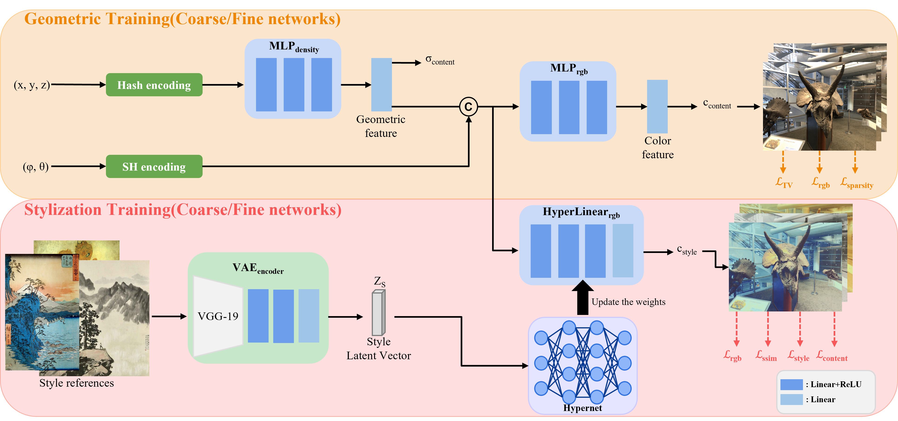

# [FMST-NeRF](soon)
  
Fast Multi-Style Transfer of Neural Radiance Fields for 3D Real-Scene.   
  
# Abstract (will change)
We present Fast Multi-Style Transfer of Neural Radiance Fields, a novel approach for stylizing arbitrary views of a 3D scene. Previous stylization methods using neuronal radiation fields can effectively predict the colors of a 3D stylized scene by combining the features of the style image with the multi-view image to transform the style features. However, these methods cannot simultaneously satisfy the important factors of stylization: zero-shot, consistency, training speed, and computational cost. Our approach method proposes a 3D real-scene stylization method that satisfies all these important factors. We first utilize hash-encoding and spherical harmonics-encoding to effectively train geometric information about the multi-view of a 3D scene. Then, we use hypernetwork to optimize the geometric features from the encoding with the feature vector of the style. Our method extends 2D style features to 3D scenes based on precise geometric information, enabling zero-shot learning while maintaining consistency. Moreover, our method takes about 3 hours to generate a stylized novel view on a modern GPU. Experimental results demonstrate that our method is superior and more effective than existing methods.  

# Dataset
**1) Download LLFF dataset.**  
You can download [NeRF_llff_Dataset](https://drive.google.com/drive/folders/128yBriW1IG_3NJ5Rp7APSTZsJqdJdfc1) this link.
```
data
├── nerf_llff_data                    
│   ├── fern
|   ├── flower
│   ├── horns            
│   └── ...
```
  
**2) Download Wikiart dataset.**  
You can download [WikiArt](https://github.com/cs-chan/ArtGAN/blob/master/WikiArt%20Dataset/README.md) this link.  
Also, you can find the WikiArt files other Stylization-NeRF-Project.  
```
wikiart
├── train                    
│   ├── [style_name1].jpg
|   ├── [style_name2].jpg
│   ├── [style_name3].jpg            
│   └── ...
│
├── test
│   ├── [test_name1].jpg
|   ├── [test_name2].jpg
│   ├── [test_name3].jpg            
│   └── ...
```
   
# Training(Pytorch; Horn training.)
### Download VAE pre-weights.
You can train VAE model [here](https://github.com/RoyalVane/ASM/tree/main/RAIN).  
Download files, and input `./pretrained` folder.  
```
pretrained
├── nerf_llff_data                    
│   ├── fc_encoder.pth
|   └── vgg_normalised.pth  
```
------------
### Geometric training
```
python run_nerf2.py --config configs/horn.txt --finest_res 1024 --log2_hashmap_size 24 --lrate 0.01 --stage first
```
------------
### Stylization training
```
python run_nerf2.py --config configs/horn.txt --finest_res 1024 --log2_hashmap_size 24 --lrate2 0.001 --stage second --no_batching
```
  
# Testing
You must change the `Stylization(Second) training` folder name like `'second_0'`.
And, implement below code.
```
python run_nerf2.py --config configs/fern.txt --finest_res 512 --log2_hashmap_size 24 --lrate2 0.001 --stage second --no_batching --render_only
# If you want render test images,
# python run_nerf2.py --config configs/fern.txt --finest_res 512 --log2_hashmap_size 24 --lrate2 0.001 --stage second --no_batching --render_only --render_test
```

# Performance (Soon update)  
**1) LPIPS Score**
- Short consistency score (5 frames)
  
| Method | Fern | Flower | Horns | Orchids | Trex | Leaves |
| ------------- | ------------- | ------------- | ------------- | ------------- | ------------- | ------------- |
| `MCCNet` | 0.1950 | 0.1541 | 0.1903 | 0.2220 | 0.1246 | 0.1306 |
| `ReReVST` | 0.2178 | 0.2093 | 0.2295 | 0.2770 | 0.1976 | 0.1776 |  
| `AdaIN` | 0.1498 | 0.1815 | 0.2443 | 0.2682 | 0.1899 | 0.1349 |
| `ARF` | 0.1600 | 0.1454 | 0.1786 | 0.2301 | 0.1041 | 0.1154 |
| `UPST` | **0.1246** | 0.1222 | **0.1306** | 0.2226 | 0.0951 | 0.0931 |
| `StyleRF` | 0.1733 | 0.1493 | 0.1957 | 0.2358 | 0.1225 | 0.1370 |
| `Ours` | 0.1291 | **0.1217** | 0.1454 | **0.2101** | **0.0879** | **0.0879** |  
   
- Long consistency score (10 frames)
  
| Method | Fern | Flower | Horns | Orchids | Trex | Leaves |
| ------------- | ------------- | ------------- | ------------- | ------------- | ------------- | ------------- |
| `MCCNet` | 0.4741 | 0.3693 | 0.4216 | 0.4468 | 0.3276 | 0.3655 |
| `ReReVST` | 0.4096 | 0.3550 | 0.4563 | 0.4577 | 0.3341 | 0.3361 |  
| `AdaIN` | 0.4106 | 0.3998 | 0.4610 | 0.4965 | 0.3575 | 0.3634 |
| `ARF` | 0.4451 | 0.3937 | 0.4497 | 0.4731 | 0.3039 | 0.3259 |
| `UPST` | **0.3969** | 0.3362 | **0.3771** | 0.4379 | 0.3054 | 0.3081 |  
| `StyleRF` | 0.4250 | 0.3543 | 0.4432 | 0.4557 | 0.3397 | 0.3794 |  
| `Ours` | 0.4065 | **0.3167** | 0.3979 | **0.4108** | **0.2895** | **0.2911** |  
  
------------  
**2) User Study**
| Previous_model vs Ours | Stylization(win rate%) | Consistency(win rate%) |
| ------------- | -------------: | -------------: |
| `AdaIN vs Ours` | 65.7% | 82.5% | 
| `MCCNet vs Ours` | 52.8% | 71.2% |
| `ARF vs Ours` | 76.3% | 55.8% |
| `UPST vs Ours` | 65.0% | 61.5% |
| `StyleRF vs Ours` | 83.5% | 64.7% |
> We collect 1200 votes for each comparison with previeous model.  
> (100 participants, 6 scenes, and 2 criteria; 3 months of online and offline voting.)  

------------  
**3) Style results** (Some examples; In github 10MB size limit issue, so we cut the files.)
(Update soon)  

# TODO
- [ ] Share Code
- [ ] Share results with video or gif format
- [ ] Make github.io
- [x] Share perforamce table
- [x] Share user study
  
# Citation
```
(Soon update)
```
  
# References
[HashNeRF](https://github.com/yashbhalgat/HashNeRF-pytorch)  
[HyperNetwork](https://github.com/vsitzmann/scene-representation-networks)  
[VAE](https://github.com/RoyalVane/ASM)  
[Style3D](https://github.com/ztex08010518/Stylizing-3D-Scene)  
[NeRF](https://github.com/yenchenlin/nerf-pytorch)  
